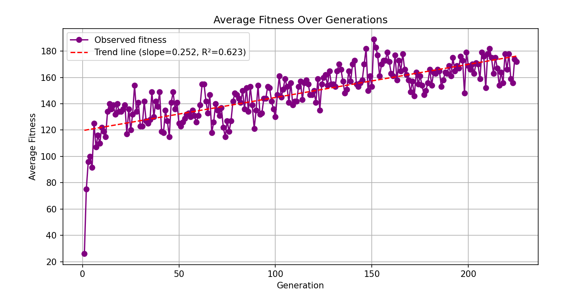
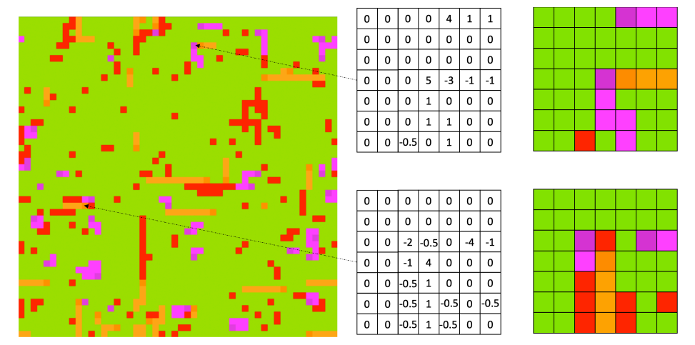
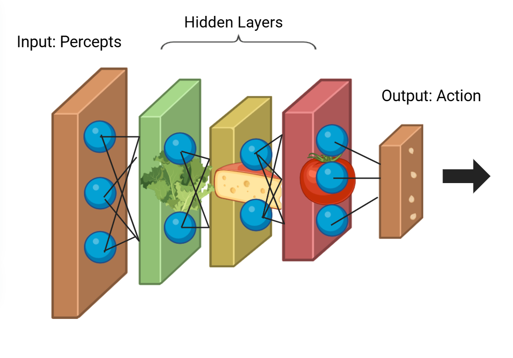
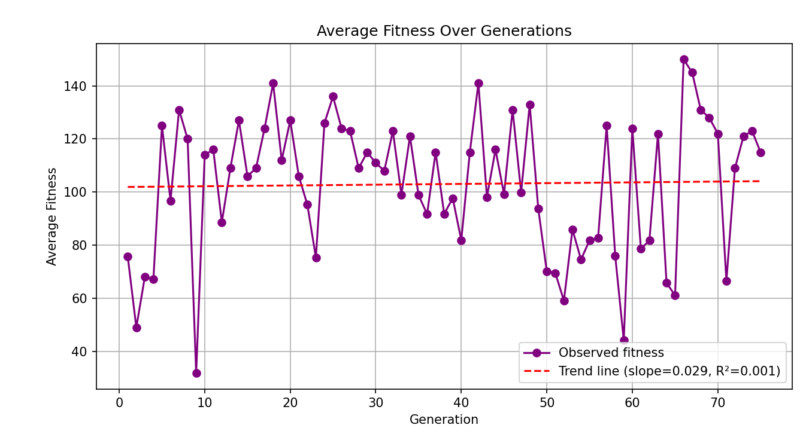
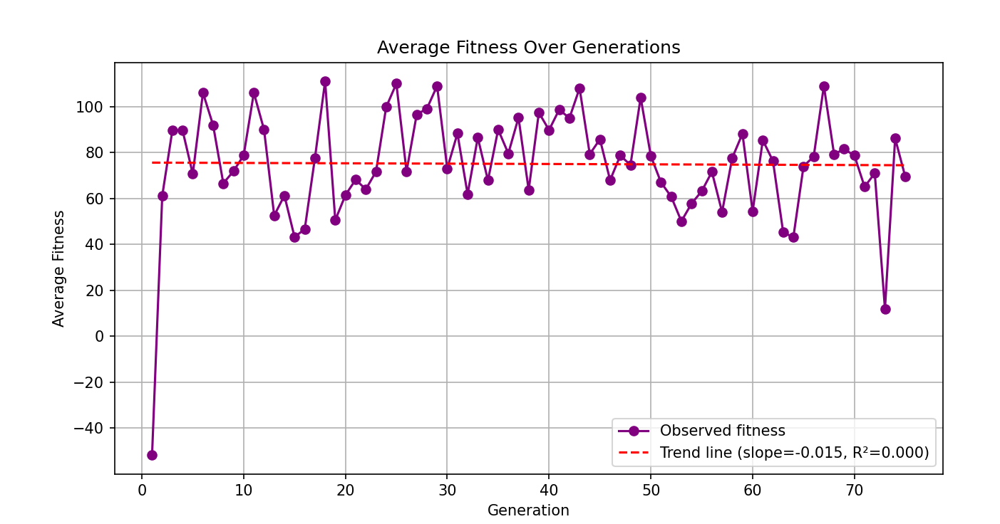
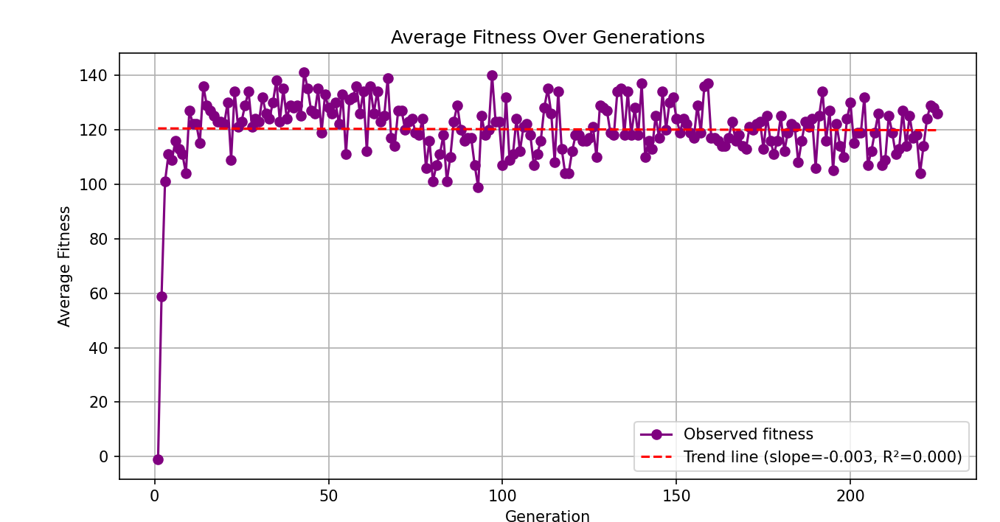
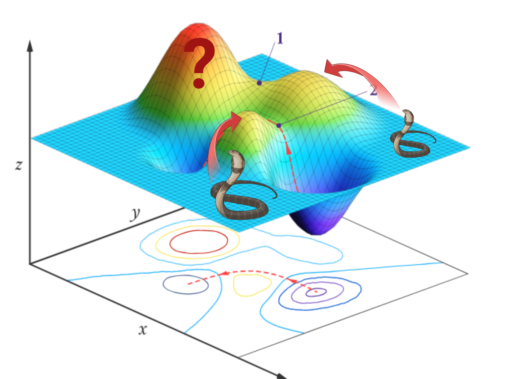

# Snakes on a Plane, a Genetic Algorithm

A neural network trained by a genetic algorithm to play a competitive snake game, built for **COSC343 (Artificial Intelligence), University of Otago**. Each snake is an independent agent: it reads a small grid of percepts around its head, feeds them through a neural network, and picks a move. The networks are not trained by backpropagation. Instead, a population of snakes evolves over many generations, with the fittest passing their network weights on to the next generation.

The final model reached an R squared of 0.623 between average fitness and generation, the strongest and most consistent upward trend across all the experiments I ran.

*The final submitted model. Average fitness climbs steadily across 225 generations (trend slope 0.252, R squared 0.623).*

---

## What I Built

The game engine, the board, the rules, and the percepts were all provided by the COSC343 teaching team (Lech Szymanski). My work is the agent and the evolutionary algorithm that trains it, all contained in `my_agent.py`. That covers:

- **The neural network**: a four-layer feed-forward network (49 input percepts, then hidden layers of 30, 10, and 20 nodes, then 3 output actions). ReLU activations on the hidden layers, and an argmax on the linear output layer to pick the move (turn left, go straight, turn right).
- **The chromosome**: each snake's entire network (every weight and bias) flattened and concatenated into a single vector of length 2093, split into 8 sections (a weights section and a bias section per layer). This is the "blueprint" that gets inherited and mutated.
- **The fitness function**: rewards average size, turns survived, eating food, and biting enemies; penalises biting friendly snakes, getting bitten, and head-on crashes. The weighting was tuned by hand through repeated testing.
- **Selection**: a random subset of a quarter of the population is drawn, then a tournament returns the two fittest of that subset as parents.
- **Crossover**: a layer-preserving crossover. Rather than cutting the chromosome at an arbitrary point (which would scramble a layer's weights), the network is split into two halves and each half is inherited intact from one parent or the other. This keeps learned layers together.
- **Mutation**: a 10 percent chance per child to mutate, and when it does, 10 randomly chosen genes are nudged to new values between -1 and 1. Deliberately gentle, to add diversity without wrecking a good solution.

A separate `Graphing.py` parses the training logs and plots average fitness against generation, fitting a trend line and computing the R squared used throughout the analysis.

> Note on style: I left some of my exploratory comments and commented-out alternatives in `my_agent.py` on purpose. They show the thinking and the dead ends, not just the final answer.

---

## How a Snake Sees the World

Each snake receives a 7x7 grid of numbers centred on its own head, oriented to its own facing direction. The numbers encode nearby food and other snakes. This 49-value grid is the input layer of the network.

*The percepts for two snakes. Left is the raw number grid, right is a colour visualisation. Image from the COSC343 assignment brief.*

The network then transforms those 49 numbers through its hidden layers down to 3 output values, and the largest one decides the move.

*The network as a sandwich: percepts go in one end, an action comes out the other, with hidden layers (and snack fillings) in between. My own diagram for the report.*

---

## The Experiments

Once the algorithm worked, I ran a parameter study: change one thing, predict what should happen, then check the graph against the prediction. A deviation from the prediction would be a sign of a bug. Most predictions held up, which was reassuring. A few of the most informative runs:

### High mutation count breaks learning
Cranking the mutation rate to 90 percent with 100 genes changed per mutation flattened the trend line almost completely (R squared 0.001). Too much random change meant the fittest snakes were effectively no longer being selected for, and the population stopped improving.

### Single-node hidden layers cannot learn
Shrinking each hidden layer to a single node collapsed learning entirely (slope -0.015, R squared 0.000). One node per layer simply cannot represent a decision as complex as this game needs.

### Bigger is not always better
Scaling up to 100 nodes per hidden layer with 100 snakes ran for a long time and then flatlined. The most likely explanation is overfitting: far more parameters than the problem needs, with the fitness signal getting diluted across all the extra nodes. A useful reminder that network capacity has to be matched to the problem, and that more compute is not a free win.

### Why crossover order matters
Testing crossover at every weight-and-bias boundary (instead of keeping layers intact) slowed learning noticeably. This was the clearest evidence that the *order and grouping* of weights matters more than the individual values: breaking a layer apart and recombining it destroys the structure the population had already learned. It is also why the final design uses the layer-preserving crossover described above.

---

## The Search-Space Intuition

One way to think about why population size matters: imagine all possible solutions as peaks on a landscape, and each starting snake as a random point on it. With too few snakes, the population can only ever climb toward the nearest peak, leaving better solutions elsewhere completely unexplored. More starting points means a better chance of finding the tallest peak.

*Too few starting points (snakes) means whole regions of the solution space, like the peak with the question mark, never get explored. My own diagram.*

---

## Key Takeaways
- A genetic algorithm can train a neural network with no gradient descent at all, purely through selection, crossover, and mutation.
- The measure of success here was not the single highest fitness reached, but *sustained, consistent improvement* over generations. That is what the R squared captures, and why a smooth climber beats a spiky one-off high score.
- Structure matters: keeping network layers intact during crossover, and matching network size to the problem, both mattered more than raw parameter counts.

---

## Running It
This agent pluggs into the COSC343 snake game engine. With the engine present, training and visualisation run through the provided `snakes.py` harness, and `Graphing.py` turns a saved training log into the fitness-over-generations plot.

## Attribution
- `my_agent.py` and `Graphing.py` are my own work.
- The snake game engine, board, rules, percept system, and the percepts image above were provided by the COSC343 teaching team (Lech Szymanski, University of Otago) and are not included in this repository.

## Tools
Python, NumPy, Matplotlib
